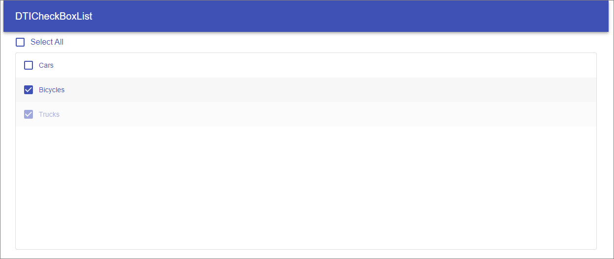
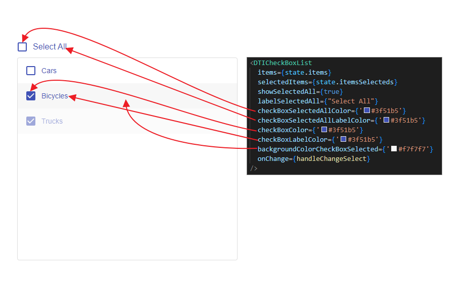

# react-dticheckboxlist

> React list component with checkbox

[](https://www.npmjs.com/package/react-dticheckboxlist) [](https://standardjs.com)

## Install

```bash
npm install --save react-dticheckboxlist
```
<p align="center">
    
</p>

## Example code of how to use

```jsx
import React, { Component } from 'react'
import DTICheckBoxList from 'react-dticheckboxlist'

class Example extends Component {
  const items =
    [{
      "id": "1",
      "label": "Cars",
      "disabled": false,
    },

    {
      "id": "2",
      "label": "Bicycles",
      "disabled": false,
    },

    {
      "id": "3",
      "label": "Trucks",
      "disabled": true,
    }
    ]

  const itemsSelecteds =
    [

      {
        "id": "2",
      },

      {
        "id": "3",
      }
    ]

    const [state, setState] = useState({
      items: items,
      itemsSelecteds: itemsSelecteds,
    });

    const handleChangeSelect = (prop) => {
      setState({
        ...state,
        itemsSelecteds: prop,
      });
    };

  render() {
    return
    <DTICheckBoxList
        items={state.items}
        selectedItems={state.itemsSelecteds}
        showSelectedAll={true}
        labelSelectedAll={"Select All"}
        checkBoxSelectedAllColor={'#3f51b5'}
        checkBoxSelectedAllLabelColor={'#3f51b5'}
        checkBoxColor={'#3f51b5'}
        checkBoxLabelColor={'#3f51b5'}
        backgroundColorCheckBoxSelected={'#f7f7f7'}
        onChange={handleChangeSelect}
        />
  }
}
```
## Color Scheme
<p align="center">
    
</p>
## License

MIT © [lucianodoria](https://github.com/lucianodoria)
